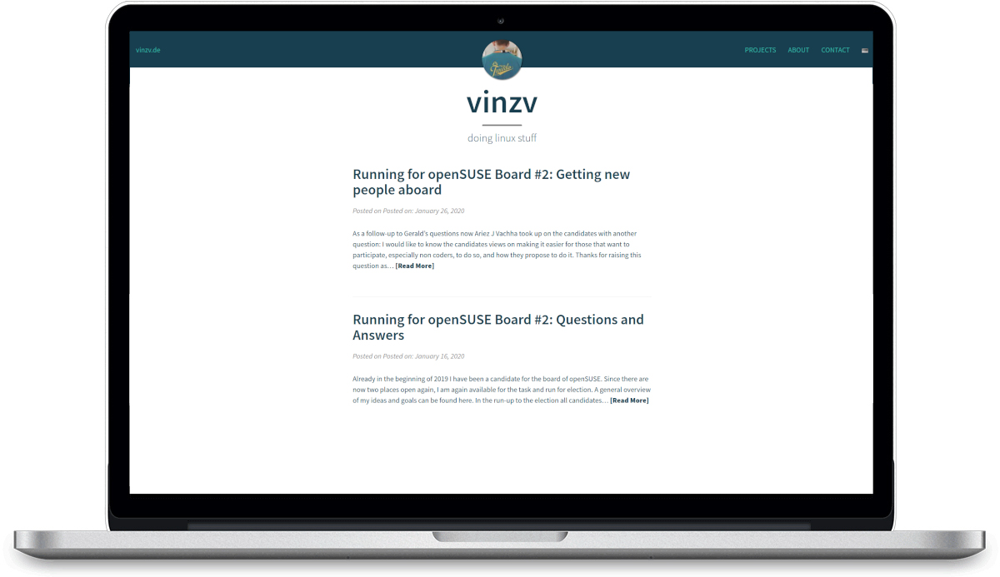

# WP-JEKYLL-GEEKO - Beautiful Wordpress

This is an Wordpress adaption of [Richard Brown's](https://github.com/sysrich/rootco.de-web) openSUSE-styled version of the [Beautiful Jekyll](http://deanattali.com/beautiful-jekyll/). It is based on [Mořeplavec's](https://github.com/moreplavec/wp-jekyll/) Wordpress port of the theme.

## Installation

### Download from GIT
1. Download this repo
2. Put all files into (your-wordpress-directory)/wp-content/themes/wp-jekyll-geeko
3. Go to Appearance > Themes and click Activate to use your new theme

### Installation via Wordpress admin (ZIP file)
1. In your admin panel, go to Appearance > Themes and click the Add New button.
2. Click Upload and Choose File, then select the theme's .zip file. Click Install Now.
3. Click Activate to use your new theme right away.

### Plugins
No plugins are required but the theme is prepared for [Polylang](https://de.wordpress.org/plugins/polylang/).

## Donate
If you want to donate please do so for the original authors.

## License
MIT Licensed, see [LICENSE](https://github.com/boh717/beautiful-ghost/blob/master/LICENSE).
